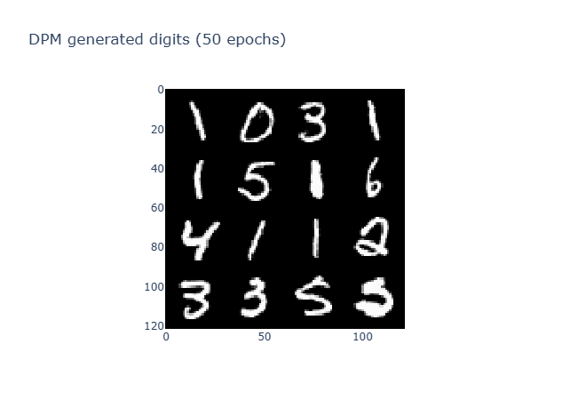
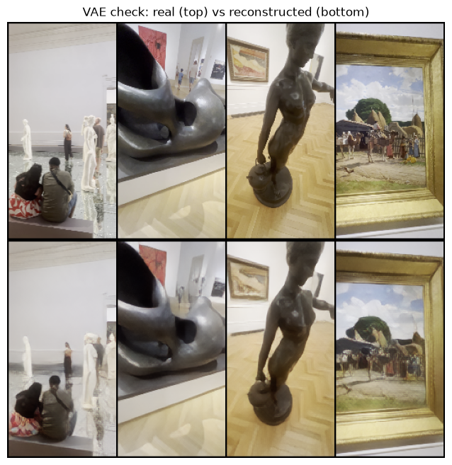
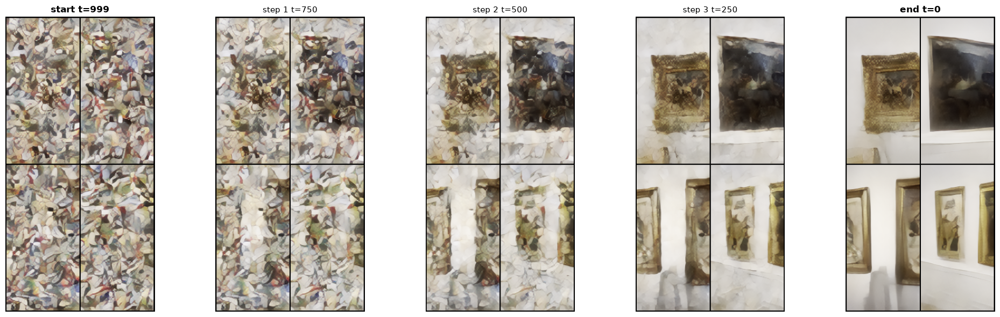
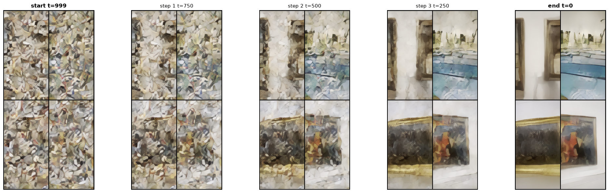
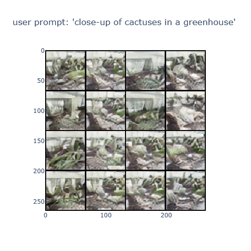
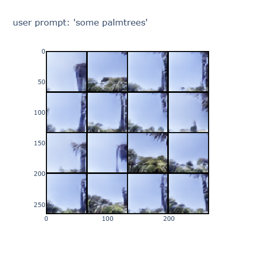
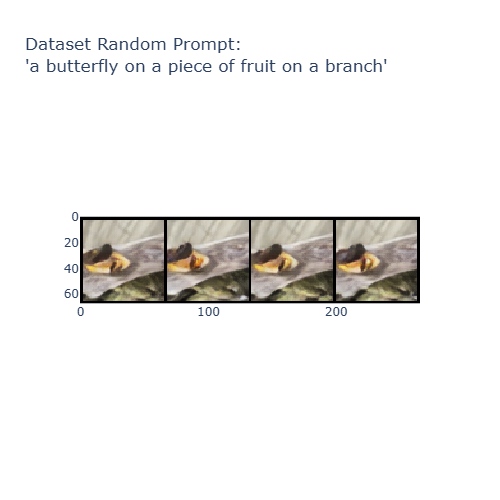
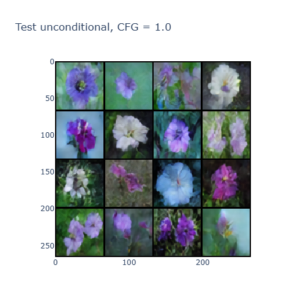
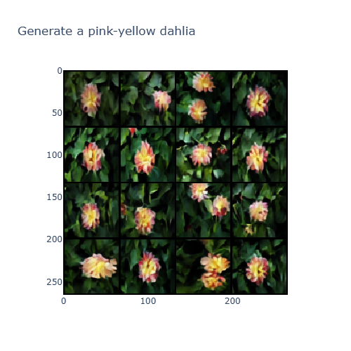
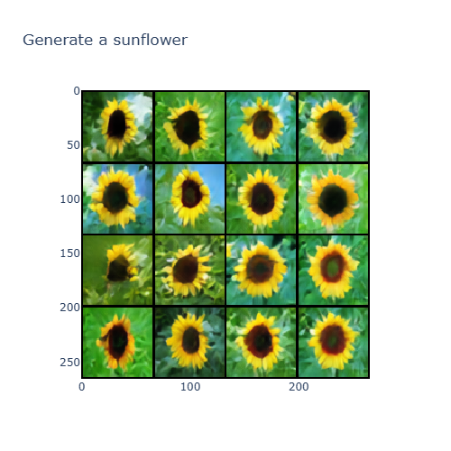

# DLAI2526
Project for DLAI course for a.y. 2025/26

Custom dataset for training (`museum.zip`, `labeled_botanical_orig.zip`) and checkpoints (for botanical dataset refer to "latest" directory) are available at the following [Drive link](https://drive.google.com/drive/folders/1qUfMhSXCMSaVScRn5XYYR59ec-ybXYyw?usp=sharing)

The main notebook is `main.ipynb`

# Deep Learning Project: From Score Matching to Text-to-Image Latent Diffusion

This repository contains the code for my deep learning project. The goal was to build diffusion models from scratch in PyTorch, starting from basic 2D point clouds and scaling up to a fully functional text-conditioned latent diffusion model trained on custom datasets.

I wrote this step-by-step to understand the math and the architecture progression behind modern generative AI, rather than just importing a pre-trained pipeline.

---

## Project Progression

The code is structured around five main milestones, where each step introduces a new concept or fixes a problem from the previous one.

### 1. 2D Toy Data and Score Matching

I started with something simple: generating 2D points in the shape of a circle and a sinusoid.

* I perturbed the data with a fixed noise level $\sigma = 0.3$ using the equation $\tilde{\mathbf{x}} = \mathbf{x} + \sigma \epsilon$.
* I built a standard Multi-Layer Perceptron (`ScoreMLPPoints`) to predict the injected noise.
* For generation, I used Langevin dynamics to step iteratively toward the clean data:

$$\tilde{\mathbf{x}}^k = \tilde{\mathbf{x}}^{k-1} + \frac{\lambda_i}{2} \mathbf{s}_\theta(\tilde{\mathbf{x}}^{k-1}, \sigma_i) + \sqrt{\lambda_i}\mathbf{z}^k$$


* I also tested different activation functions. ReLU worked best, while saturating functions like Sigmoid completely failed due to vanishing gradients.

### 2. Noise-Conditional Score Networks (NCSN)

Standard score matching struggles in areas where data is sparse. To fix this, I conditioned the network on the noise level itself. I used an annealed schedule with 8 decreasing noise scales (from 4.0 down to 0.05). During sampling, the model runs 125 steps per scale, which gives much better coverage of the data manifold.

### 3. DDPM on MNIST

Next, I moved to pixel space to generate handwritten digits.

* I implemented the $T=1000$ step forward process and used the reparameterization trick to jump to any timestep:

$$x^{(t)} = \sqrt{\bar{\alpha}_t}x^{(0)} + \sqrt{1 - \bar{\alpha}_t}\epsilon$$


* I built a time-conditioned U-Net, but the initial bottleneck activations were highly unstable. To get it to train properly, I had to introduce three fixes:
1. `GroupNorm` (8 groups) to stabilize the layers without relying on batch size.
2. Exponential Moving Average (EMA) to keep the weights smooth.
3. Deeper residual blocks with skip connections to increase the receptive field.



### 4. Latent Diffusion Models (LDM)

Generating raw pixels is too heavy, so I built a convolutional Variational Autoencoder (VAE) with about 5.8M parameters to compress the images into a 4-channel latent space.

* The VAE loss combines three terms:

$$\mathcal{L}_{total} = \mathcal{L}_{L1} + \omega_{p} \mathcal{L}_{LPIPS} + \omega_{kl} \mathcal{L}_{KL}$$


I used L1 to keep edges sharp, LPIPS (via a frozen VGG network) for perceptual quality, and KL divergence to regularize the space.


> *VAE check: real (top) vs reconstructed (bottom).*

* To prevent the diffusion model from collapsing, I calculated a scale factor $s = 1/\sigma_z$ to ensure the latents maintain a unit variance ($\sigma \approx 1$).
* The diffusion model itself is a `LatentUNet` with self-attention, trained to predict velocity (v-prediction) under a cosine noise schedule.

**Latent Denoising Process Over Time:**



### 5. Multimodal Text-to-Image

The final step was making the model respond to text.

* I froze a pre-trained OpenAI CLIP encoder (`ViT-B/32`) to map text prompts into embeddings.
* I added `CrossAttentionBlock` layers to the U-Net so the spatial image features (Queries) could interact with the text features (Keys and Values):

$$\text{Attention}(Q, K, V) = \text{softmax}\left(\frac{Q K^T}{\sqrt{d_k}}\right)V$$


* To make the text prompts actually guide the image generation, I implemented Classifier-Free Guidance (CFG), randomly dropping the text captions 10% of the time during training.

**Botanical Garden Dataset Results:**





**Classifier-Free Guidance (CFG) Tests:**





---

## Custom Datasets and Preprocessing

I wanted to test the model on my own data, so I recorded videos on my phone and processed them into datasets.

* **Botanical Garden Dataset:** 4K video frames from the Orto Botanico di Roma (April 2026).
* **Museum Dataset:** HD video frames from the Galleria Nazionale d'Arte Moderna e Contemporanea (July 2026).

**Data Pipeline:**
Extracting video frames creates a lot of almost identical images. To clean this up, I wrote a semantic deduplication script. I passed every frame through CLIP and calculated the cosine similarity. If consecutive frames had a similarity $> 0.95$, I discarded them. This shrank the museum dataset from about 38,000 frames down to a clean 4,690.

**RAM Caching:**
Disk I/O was slowing down my training significantly. Instead of loading images and running the VAE text encoder for every batch, the `LDMDataset` script pre-encodes all images into scaled latents and caches the CLIP text embeddings directly in RAM before the training loop starts.

---

## Sampling and Inference

I implemented a few different ways to generate images from the trained model:

* **DDPM:** The standard ancestral sampling over all 1000 steps.
* **DDIM:** A faster, deterministic sampler that skips steps. I usually run this at 50 or 250 steps to save time.
* **Classifier-Free Guidance (CFG):** Extrapolates between the unconditional and conditional predictions during inference to force the model to follow the prompt:

$$\tilde{\epsilon}_{\theta} = (1+w)\epsilon_{\theta}(c) - w\epsilon_{\theta}(\emptyset)$$


* **Latent Clipping:** When using high CFG scales, the variance can explode. I added a safeguard to clamp the predicted clean state $x_0$ to a safe range to keep the output stable.

---

## How to Run

Install the required dependencies:

```bash
uv sync
```
- First version: run main.ipynb
- Second version: run plants_generation.py to generate flowers/plants, ffhq256_gen.py to generate human faces; ldm_museum.ipynb has been run on colab to generate museum images.

The script automatically detects what hardware you are running on and assigns the device accordingly (CUDA for NVIDIA, MPS for Apple Silicon, or CPU as a fallback). Just run the notebook sequentially.
